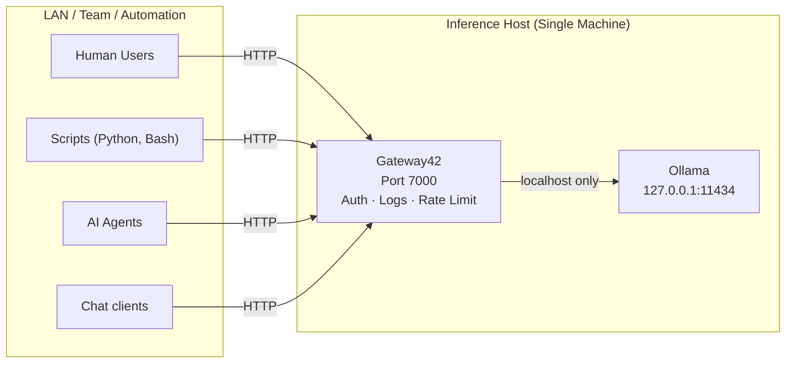

# Gateway42. — An opinionated gateway for Ollama

**Authenticated, audited, rate-limited API gateway for local LLMs. On-prem. Privacy-first.**

Gateway42. sits between your users and a shared [Ollama](https://ollama.com) instance, exposing an **OpenAI-compatible API** while adding authentication, per-user rate limiting, and full audit logging. Any client or library built for the OpenAI API works with Gateway42. without code changes — just swap the base URL and API key.


## Architecture



**The gateway must be installed on the same machine as Ollama.** Ollama listens only on `127.0.0.1:11434` and is never exposed over the LAN. All external access goes through the gateway.


## What Gateway42. adds

| Capability         | Ollama  | Gateway42 |
| ------------------ | ------- | --------- |
| LAN API            | No      | Yes       |
| OpenAI-compatible  | No      | Yes       |
| API key auth       | No      | Yes       |
| Per-user isolation | No      | Yes       |
| Rate limiting      | No      | Yes       |
| Prompt logging     | No      | Yes       |
| Response logging   | No      | Yes       |
| CSV audit export   | No      | Yes       |
| Admin dashboard    | No      | Yes       |


## Design philosophy

- Ollama stays **localhost-only** — never exposed directly
- All access is **authenticated** via API keys
- All requests are **logged** for auditability
- Rate limits **protect system stability**
- The admin UI exists for **governance only**, not inference

## Quick start (native)
**Prerequisites:** Go 1.2x, [Ollama](https://ollama.com/download) running on the host.
```bash
# 1. Make sure Ollama is running
ollama serve

# 2. Build and start
go build -o gateway42 .
./gateway42

# 3. Open the admin UI
open http://localhost:7000
```

> Default admin password is `admin123`. Change it after first login via the admin UI.


## macOS Service (launchd)

Install gateway42 as a persistent background service that starts automatically at login:

```bash
./install.sh
```

The script will:
- Build the binary if needed
- Install it to `/usr/local/bin/gateway42`
- Create data directories at `~/.gateway42/` and `~/Library/Logs/gateway42/`
- Register and start a LaunchAgent (`com.gateway42.service`)

**Service management:**

```bash
# View status and exit code
launchctl list com.gateway42.service

# Follow logs
tail -f ~/Library/Logs/gateway42/gateway.log

# Stop / start
launchctl stop com.gateway42.service
launchctl start com.gateway42.service

# Uninstall (removes binary and plist, preserves data)
./install.sh uninstall
```

The service restarts automatically on crash. It stops cleanly on `launchctl stop`.


## API reference

Gateway42 exposes an **OpenAI-compatible API**. Point any OpenAI client at Gateway42 by changing the base URL and providing a Gateway42 API key.

### Base URL

```
http://<your-host>:7000/v1
```

### Authentication

Pass the user's API key as a Bearer token:

```
Authorization: Bearer <api_key>
```

Requests with a missing, invalid, or deactivated key are rejected with `401 Unauthorized`.

### Endpoints

| Endpoint | Method | Description |
| -------- | ------ | ----------- |
| `/v1/chat/completions` | POST | Chat completion. Accepts OpenAI-format bodies. Set `"stream": true` for SSE streaming. |
| `/v1/models` | GET | Returns installed Ollama models in OpenAI format. |
| `/health` | GET | Returns `{"status": "ok"}`. No auth required. Use for uptime monitoring. |

### Example — cURL

```bash
curl http://<host>:7000/v1/chat/completions \
  -H "Authorization: Bearer <api_key>" \
  -H "Content-Type: application/json" \
  -d '{
    "model": "llama3.2:latest",
    "messages": [{"role": "user", "content": "Hello!"}]
  }'
```

### Example — Python (openai SDK)

```python
from openai import OpenAI

client = OpenAI(
    base_url="http://<host>:7000/v1",
    api_key="<api_key>",
)

response = client.chat.completions.create(
    model="llama3.2:latest",
    messages=[{"role": "user", "content": "Hello!"}],
)
print(response.choices[0].message.content)
```

### Supported Parameters

The following OpenAI parameters are translated to Ollama equivalents:

| OpenAI parameter | Ollama parameter | Notes |
| ---------------- | ---------------- | ----- |
| `model` | `model` | Must match an installed Ollama model name |
| `messages` | `messages` | Full conversation history |
| `stream` | `stream` | SSE streaming when `true` |
| `temperature` | `temperature` | |
| `top_p` | `top_p` | |
| `max_tokens` | `num_predict` | |
| `seed` | `seed` | |
| `stop` | `stop` | String or list of strings |
| `presence_penalty` | `repeat_last_n` | |
| `frequency_penalty` | `repeat_penalty` | Mapped as `1.0 + value` |

### Error Codes

| Status | Meaning |
| ------ | ------- |
| `401` | Missing, invalid, or deactivated API key |
| `429` | Rate limit exceeded — wait before retrying |
| `502` | Gateway42 could not reach the Ollama instance |
| `500` | Internal server error |

### More help
Gateway42. has a built-in help page providing much information.


## Rate Limiting

Gateway42 enforces a **sliding window rate limit** per user (60-second window).

- Default: **10 requests per minute** per user
- Configurable per-user from the Admin Dashboard
- Returns `429 Too Many Requests` when exceeded
- Applies to scripts, automation, and pipelines
- Counters reset on *Reset System* or when a user is deleted
- Default for new users is set by the `DEFAULT_RATE_LIMIT` environment variable


## Admin Dashboard

Access at `http://<host>:7000`. Admin-only — not intended for end users.

### Default Admin Credentials

- No username
- Password: `admin123` (or the value of `ADMIN_PASSWORD` if set)
- **Change your password after first login**

### User Management

New users are registered with a unique API key and start in **DISABLED** status. Activate them manually once you have shared their key securely. Available actions per user:

| Action | Description |
| ------ | ----------- |
| Toggle status | Switch between **ACTIVE** and **DISABLED**. Only active users can make API requests. |
| Set rate limit | Adjust requests-per-minute (1–1000) per user. |
| New API key | Generates a fresh key and immediately invalidates the old one. Displayed once — copy it before leaving the page. |
| Export CSV | Downloads all audit log entries for this user. Required before deletion. |
| Delete | Permanently removes the user and their log entries. CSV export must be done first. |


### Model Management (Settings page)

- View all models installed on the Ollama instance with their disk size
- **Delete** a model to free disk space
- **Search** for models on ollama.com and download them with live progress tracking
- Supports both standard models (e.g. `llama3.2`) and namespaced models (e.g. `batiai/qwen3.6-35b`)


### Audit Logs

Every request is recorded with: timestamp, user, model, prompt, and response.

- Logs page shows the most recent 200 entries by default
- Search by prompt text, response text, or user email
- Auto-refresh: Off / 5s / 10s / 30s / 60s
- Export **all** log entries as CSV (`log_id`, `email`, `model`, `prompt`, `response`, `timestamp`)

Request logs:  


System Logs:  


### Reset System

Permanently deletes all audit logs and rate-limit counters. User accounts and settings are not affected. This action cannot be undone.


## Configuration

All configuration is via environment variables. No variables are strictly required — sensible defaults are applied.

| Variable | Default | Description |
| -------- | ------- | ----------- |
| `ADMIN_PASSWORD` | `admin123` | Password for the admin login page. **Change after first login.** |
| `PORT` | `7000` | Port the HTTP/HTTPS server listens on. |
| `OLLAMA_URL` | `http://127.0.0.1:11434/api/chat` | Default Ollama endpoint. Can be overridden from the Settings page. |
| `GW42_DB_PATH` | `./db/gateway.db` | Path to the SQLite database file. Avoid network-mounted filesystems. |
| `DEFAULT_RATE_LIMIT` | `10` | Default requests-per-minute for newly registered users. |
| `SESSION_TIMEOUT` | `3600` | Admin session lifetime in seconds. |
| `MAX_MESSAGE_LENGTH` | `10000` | Maximum characters stored per prompt or response in the audit log. |
| `LOG_LEVEL` | `INFO` | Log verbosity: `DEBUG`, `INFO`, `WARNING`, `ERROR`. |
| `LOG_FILE` | `./logs/gateway.log` | Path to the application log file. |
| `TLS_CERT` | _(empty)_ | Path to TLS certificate file. When set with `TLS_KEY`, enables HTTPS. |
| `TLS_KEY` | _(empty)_ | Path to TLS private key file. When set with `TLS_CERT`, enables HTTPS. |

Using a `.env` file (native / local runs):

```bash
# .env
ADMIN_PASSWORD=your-admin-password
PORT=7000
```


## Known Design Constraints

This gateway intentionally does not handle:

| Scenario | Outcome |
| -------- | ------- |
| Hundreds of concurrent users | Inference starvation |
| Public internet traffic | Rate-limited / denied |
| Large file uploads | GPU contention |
| Unbounded token use | Latency spikes |

These are deliberate design boundaries, not bugs.
