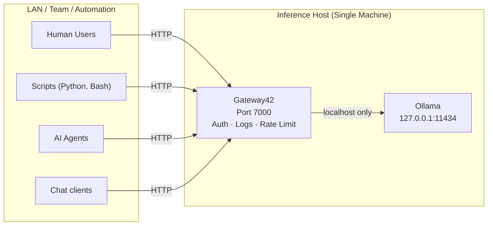

# Gateway42 — Ollama LAN AI Gateway

**Authenticated, audited, rate-limited API gateway for local LLMs. On-prem. Privacy-first.**

Gateway42 sits between your users and a shared [Ollama](https://ollama.com) instance, exposing an **OpenAI-compatible API** while adding authentication, per-user rate limiting, and full audit logging. Any client or library built for the OpenAI API works with Gateway42 without code changes — just swap the base URL and API key.


## Architecture



**The gateway must be installed on the same machine as Ollama.** Ollama listens only on `127.0.0.1:11434` and is never exposed over the LAN. All external access goes through the gateway.


## What Gateway42 Adds

| Capability         | Ollama  | Gateway42 |
| ------------------ | ------- | --------- |
| LAN API            | No      | Yes       |
| OpenAI-compatible  | No      | Yes       |
| API key auth       | No      | Yes       |
| Per-user isolation | No      | Yes       |
| Rate limiting      | No      | Yes       |
| Prompt logging     | No      | Yes       |
| Response logging   | No      | Yes       |
| CSV audit export   | No      | Yes       |
| Admin dashboard    | No      | Yes       |


## Design Philosophy

- Ollama stays **localhost-only** — never exposed directly
- All access is **authenticated** via API keys
- All requests are **logged** for auditability
- Rate limits **protect system stability**
- The admin UI exists for **governance only**, not inference


---


## Quick Start (Docker)

**Prerequisites:** Docker 24+, Docker Compose v2, [Ollama](https://ollama.com/download) running on the host.

```bash
# 1. Make sure Ollama is running
ollama serve

# 2. Edit docker-compose.yml — set your secrets:
#    OLLAMA_GATEWAY_SECRET_KEY  — any long random string
#    ADMIN_PASSWORD             — your chosen admin password

# 3. Build and start
docker compose up -d

# 4. Open the admin UI
open http://localhost:7000
```

**Persistent data** is stored in two named Docker volumes created automatically:
- `gateway42-db` — SQLite database (users, logs, settings)
- `gateway42-logs` — application log files

Data survives container restarts and upgrades. To wipe everything: `docker compose down -v`.

### Run Without Compose

```bash
docker build -t gateway42:latest .

docker run -d \
  -p 7000:7000 \
  --add-host=host.docker.internal:host-gateway \
  -e OLLAMA_GATEWAY_SECRET_KEY="your-secret" \
  -e ADMIN_PASSWORD="your-password" \
  -e OLLAMA_URL="http://host.docker.internal:11434/api/chat" \
  -v gateway42-db:/gateway/db \
  -v gateway42-logs:/gateway/logs \
  --name gateway42 \
  gateway42:latest
```

> The `--add-host` flag is required on Linux. On macOS/Windows with Docker Desktop it is optional.

### Upgrading

```bash
docker compose build   # rebuild the image
docker compose up -d   # replace the running container
```

The SQLite schema migrates automatically on startup — no manual steps needed.

### Host Networking Note

Inside a Docker container, `localhost` refers to the container itself. Gateway42 uses `host.docker.internal` to reach Ollama on the host:
- **macOS / Windows** — Docker Desktop provides this automatically.
- **Linux** — the `extra_hosts: host.docker.internal:host-gateway` entry in `docker-compose.yml` handles this. No extra setup needed.


---


## Kubernetes Deployment

Ready-to-use manifests are in the `k8s/` directory. They deploy Gateway42 as a single-replica Deployment backed by PersistentVolumeClaims.

| File | Purpose |
| ---- | ------- |
| `k8s/secret.yaml` | `OLLAMA_GATEWAY_SECRET_KEY` and `ADMIN_PASSWORD` as a Kubernetes Secret |
| `k8s/configmap.yaml` | Non-sensitive config (Ollama URL, rate limits, log level, etc.) |
| `k8s/pvc.yaml` | PersistentVolumeClaims: database (1 Gi) and logs (2 Gi) |
| `k8s/deployment.yaml` | Deployment with health probes and resource limits |
| `k8s/service.yaml` | ClusterIP Service on port 80 and Ingress resource |

```bash
# 1. Build and push your image
docker build -t your-registry/gateway42:latest .
docker push your-registry/gateway42:latest

# 2. Update the image reference in k8s/deployment.yaml

# 3. Create secrets
kubectl create secret generic gateway42-secret \
  --from-literal=OLLAMA_GATEWAY_SECRET_KEY="your-long-random-string" \
  --from-literal=ADMIN_PASSWORD="your-admin-password"

# 4. Apply manifests
kubectl apply -f k8s/configmap.yaml
kubectl apply -f k8s/pvc.yaml
kubectl apply -f k8s/deployment.yaml
kubectl apply -f k8s/service.yaml

# 5. Check rollout
kubectl rollout status deployment/gateway42
```

**Accessing the UI:** The Service is a `ClusterIP` on port 80. Options for external access:
- Change `type: LoadBalancer` in `k8s/service.yaml`, or
- Configure the Ingress with your domain and an ingress controller, or
- Port-forward locally: `kubectl port-forward svc/gateway42 7000:80`

**Connecting to Ollama:** The default `OLLAMA_URL` in `k8s/configmap.yaml` points to `http://ollama:11434/api/chat` (assumes Ollama is a Service named `ollama` in the same namespace). You can override this from the Settings page at any time.

**Scaling:** Gateway42 uses SQLite, which supports one writer at a time. Keep `replicas: 1` and scale at the Ollama level instead.

**Resource limits** (defaults in `k8s/deployment.yaml`):

| | CPU | Memory |
|---|---|---|
| Request | 100m | 128 Mi |
| Limit | 500m | 512 Mi |


---


## API Reference

Gateway42 exposes an **OpenAI-compatible API**. Point any OpenAI client at Gateway42 by changing the base URL and providing a Gateway42 API key.

### Base URL

```
http://<your-host>:7000/v1
```

### Authentication

Pass the user's API key as a Bearer token:

```
Authorization: Bearer <api_key>
```

Requests with a missing, invalid, or deactivated key are rejected with `401 Unauthorized`.

### Endpoints

| Endpoint | Method | Description |
| -------- | ------ | ----------- |
| `/v1/chat/completions` | POST | Chat completion. Accepts OpenAI-format bodies. Set `"stream": true` for SSE streaming. |
| `/v1/models` | GET | Returns installed Ollama models in OpenAI format. |
| `/health` | GET | Returns `{"status": "ok"}`. No auth required. Use for uptime monitoring. |

### Example — cURL

```bash
curl http://<host>:7000/v1/chat/completions \
  -H "Authorization: Bearer <api_key>" \
  -H "Content-Type: application/json" \
  -d '{
    "model": "llama3.2:latest",
    "messages": [{"role": "user", "content": "Hello!"}]
  }'
```

### Example — Python (openai SDK)

```python
from openai import OpenAI

client = OpenAI(
    base_url="http://<host>:7000/v1",
    api_key="<api_key>",
)

response = client.chat.completions.create(
    model="llama3.2:latest",
    messages=[{"role": "user", "content": "Hello!"}],
)
print(response.choices[0].message.content)
```

### Supported Parameters

The following OpenAI parameters are translated to Ollama equivalents:

| OpenAI parameter | Ollama parameter | Notes |
| ---------------- | ---------------- | ----- |
| `model` | `model` | Must match an installed Ollama model name |
| `messages` | `messages` | Full conversation history |
| `stream` | `stream` | SSE streaming when `true` |
| `temperature` | `temperature` | |
| `top_p` | `top_p` | |
| `max_tokens` | `num_predict` | |
| `seed` | `seed` | |
| `stop` | `stop` | String or list of strings |
| `presence_penalty` | `repeat_last_n` | |
| `frequency_penalty` | `repeat_penalty` | Mapped as `1.0 + value` |

### Error Codes

| Status | Meaning |
| ------ | ------- |
| `401` | Missing, invalid, or deactivated API key |
| `429` | Rate limit exceeded — wait before retrying |
| `502` | Gateway42 could not reach the Ollama instance |
| `500` | Internal server error |


---


## Rate Limiting

Gateway42 enforces a **sliding window rate limit** per user (60-second window).

- Default: **10 requests per minute** per user
- Configurable per-user from the Admin Dashboard
- Returns `429 Too Many Requests` when exceeded
- Applies to scripts, automation, and pipelines
- Counters reset on *Reset System* or when a user is deleted
- Default for new users is set by the `DEFAULT_RATE_LIMIT` environment variable


---


## Admin Dashboard

Access at `http://<host>:7000`. Admin-only — not intended for end users.

### Default Admin Credentials

- Username: `admin` (or the value of `ADMIN_EMAIL`)
- Password: set via `ADMIN_PASSWORD` environment variable
- **Change your password after first login**

### User Management

New users are registered with a unique API key and start in **DISABLED** status. Activate them manually once you have shared their key securely. Available actions per user:

| Action | Description |
| ------ | ----------- |
| Toggle status | Switch between **ACTIVE** and **DISABLED**. Only active users can make API requests. |
| Set rate limit | Adjust requests-per-minute (1–1000) per user. |
| New API key | Generates a fresh key and immediately invalidates the old one. Displayed once — copy it before leaving the page. |
| Export CSV | Downloads all audit log entries for this user. Required before deletion. |
| Delete | Permanently removes the user and their log entries. CSV export must be done first. |

### Model Management (Settings page)

- View all models installed on the Ollama instance with their disk size
- **Delete** a model to free disk space
- **Download** a model by name (e.g. `llama3.2:latest`) with live progress tracking
- Browse available models at [ollama.com/models](https://ollama.com/models)

### Audit Logs

Every request is recorded with: timestamp, user, model, prompt, and response.

- Logs page shows the most recent 200 entries by default
- Search by prompt text, response text, or user email
- Auto-refresh: Off / 5s / 10s / 30s / 60s
- Export **all** log entries as CSV (`log_id`, `email`, `model`, `prompt`, `response`, `timestamp`)

### Reset System

Permanently deletes all audit logs and rate-limit counters. User accounts and settings are not affected. This action cannot be undone.


---


## Configuration

Set these environment variables before starting Gateway42. Variables marked **required** must be set or the application will refuse to start.

| Variable | Required | Default | Description |
| -------- | -------- | ------- | ----------- |
| `OLLAMA_GATEWAY_SECRET_KEY` | **Yes** | — | Secret key for signing session cookies. Use a long, random string. |
| `ADMIN_PASSWORD` | **Yes** | — | Password for the admin login page. |
| `OLLAMA_URL` | No | `http://127.0.0.1:11434/api/chat` | Default Ollama endpoint. Can be overridden from the Settings page. |
| `ADMIN_EMAIL` | No | `admin` | Admin account identifier shown in logs. |
| `OLLAMA_GATEWAY_DB_PATH` | No | `./db/gateway.db` | Path to the SQLite database file. Avoid network-mounted filesystems. |
| `DEFAULT_RATE_LIMIT` | No | `10` | Default requests-per-minute for newly registered users. |
| `SESSION_TIMEOUT` | No | `3600` | Admin session lifetime in seconds. |
| `MAX_MESSAGE_LENGTH` | No | `10000` | Maximum characters stored per prompt or response in the audit log. |
| `LOG_LEVEL` | No | `INFO` | Python logging level: `DEBUG`, `INFO`, `WARNING`, `ERROR`. |
| `LOG_FILE` | No | `./logs/gateway.log` | Path to the application log file. |
| `DEBUG` | No | `false` | Set to `true` to enable debug mode. Do not use in production. |

Using a `.env` file:

```bash
# .env
OLLAMA_GATEWAY_SECRET_KEY=your-long-random-string
ADMIN_PASSWORD=your-admin-password
ADMIN_EMAIL=admin@example.com
```


---


## Known Design Constraints

This gateway intentionally does not handle:

| Scenario | Outcome |
| -------- | ------- |
| Hundreds of concurrent users | Inference starvation |
| Public internet traffic | Rate-limited / denied |
| Large file uploads | GPU contention |
| Unbounded token use | Latency spikes |

These are deliberate design boundaries, not bugs.


---


## Audit & Compliance

| Property | Detail |
| -------- | ------ |
| Storage | SQLite (WAL mode) — safe for concurrent reads |
| Growth | Linear with usage |
| Export | CSV, per-user or full log |
| Deletion | CSV export required before user deletion |

Suitable for: research validation, automation debugging, incident investigation, compliance review.
