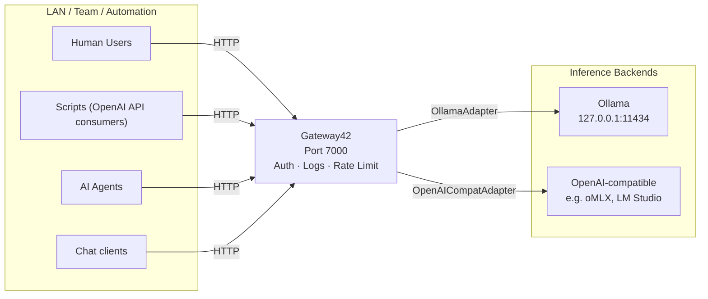

# Gateway42. — An opinionated AI gateway

**Authenticated, audited, rate-limited API gateway for local and remote LLMs. On-prem. Privacy-first.**

Gateway42. sits between your users and your AI inference backends, exposing an **OpenAI-compatible API** while adding authentication, per-user rate limiting, and full request logging. It supports both local [Ollama](https://ollama.com) instances and any remote **OpenAI-compatible endpoint** — LM Studio, oMLX, or the real OpenAI API. Any client or library built for the OpenAI API works with Gateway42. without code changes — just swap the base URL and API key.


## Contents

- [Architecture](#architecture) · [Request pipeline](#request-pipeline)
- [What Gateway42. adds](#what-gateway42-adds) · [Design philosophy](#design-philosophy)
- [Quick start](#quick-start-not-for-production) · [Install as a service](#installing-gateway42-as-a-service-launchd)
- [Multi-engine support](#multi-engine-support) · [Engine selection](#engine-selection)
- [API reference](#api-reference) · [Parameters](#parameters) · [Streaming](#streaming) · [Error codes](#error-codes)
- [Rate limiting](#rate-limiting) · [Concurrency and load shedding](#concurrency-and-load-shedding)
- [Observability](#observability) · [Security model](#security-model) · [Storage and data handling](#storage-and-data-handling)
- [Admin dashboard](#admin-dashboard) · [Audit logs](#audit-logs)
- [Configuration](#configuration) · [Timeouts and limits](#timeouts-and-limits)
- [Development](#development) · [Known design constraints](#known-design-constraints)

## Architecture


```mermaid
flowchart LR
    subgraph Backends["Inference Backends"]
        OLLAMA["Ollama\n127.0.0.1:11434"]
        OPENAI["OpenAI-compatible\ne.g. oMLX, LM Studio"]
    end

    GATEWAY["Gateway42\nPort 7000\nAuth · Logs · Rate Limit"]

    subgraph LAN["LAN / Team / Automation"]
        USERS["Human Users"]
        SCRIPTS["Scripts (OpenAI API consumers)"]
        AGENTS["AI Agents"]
        CHAT["Chat clients"]
    end

    USERS & SCRIPTS & AGENTS & CHAT -->|HTTP| GATEWAY
    GATEWAY -->|OllamaAdapter| OLLAMA
    GATEWAY -->|OpenAICompatAdapter| OPENAI
```

You can run Gateway42. on the same machine as Ollama, with Ollama listening only on `127.0.0.1:11434` and never exposed over the LAN. Or point it at a remote OpenAI-compatible endpoint. Either way, all external access goes through the gateway.

### Request pipeline

Every request passes through the same middleware chain, outermost first. The order is deliberate:

| # | Middleware | Responsibility |
| - | ---------- | -------------- |
| 1 | `metricsMiddleware` | Records count, latency, and the in-flight gauge. Outermost so that a panic recovered below it has already resolved into a status by the time it measures. |
| 2 | `recoveryMiddleware` | Converts a panic in any handler below it into a response instead of a dropped connection, picking the response format from the path and from whether the response was already committed. |
| 3 | `corsMiddleware` | Applies CORS headers so browser-based OpenAI clients work. |
| 4 | `apiAuthMiddleware` | Resolves the Bearer token to a user once, for `/v1/*`, and puts it in the request context. |
| 5 | `csrfMiddleware` | Rejects state-changing admin requests without a valid token — before any handler mutates state. |
| 6 | `requestLoggingMiddleware` | Writes the HTTP request log. Runs innermost so it can read the user resolved in step 4. |

Auth before CSRF, and both before logging, is what lets the request log name the user who made the
call and record the status a rejection actually produced.

The first two are the pair that is easy to get backwards. Middleware defers unwind inside-out, so
the layer that *writes* the panic response has to sit inside the layer that *measures* it. With
recovery outermost — the intuitive arrangement — a panic unwound through `metricsMiddleware` before
recovery ever saw it, and recovered panics were simply absent from the request count and the latency
histogram. Recording in a `defer` alone does not fix that; it only changes the symptom, because
metrics would then observe before recovery had written anything. Metrics outermost and recovery
second is what makes the two agree.

The cost of that ordering is that a panic in `metricsMiddleware` itself is no longer caught by the
application. It falls through to `net/http`'s per-connection recovery, which drops that one
connection and logs it — the process survives. That layer is a dozen lines of Prometheus calls with
label counts fixed at compile time, so the exposure is deliberately kept small.

All three layers that need the status code — metrics, recovery, and the request log — share a single
`statusRecorder`, installed by whichever runs first. They previously wrapped the writer one each,
which stacked three recorders per request and left only the innermost seeing the handler's own
`WriteHeader`.


## What Gateway42. adds

| Capability              | Ollama  | Gateway42 |
| ----------------------- | ------- | --------- |
| LAN API                 | No      | Yes       |
| OpenAI-compatible API   | No      | Yes       |
| Multiple engine backends| No      | Yes       |
| Model-aware routing     | No      | Yes       |
| API key auth            | No      | Yes       |
| Per-user isolation      | No      | Yes       |
| Rate limiting           | No      | Yes       |
| Upstream load shedding  | No      | Yes       |
| AI interaction logging  | No      | Yes       |
| HTTP request logging    | No      | Yes       |
| Log retention policy    | No      | Yes       |
| CSV audit export        | No      | Yes       |
| Full-text log search    | No      | Yes       |
| Prometheus metrics      | No      | Yes       |
| Admin dashboard         | No      | Yes       |


## Design philosophy

- All access is **authenticated** via API keys — no unauthenticated requests reach the engine
- All API traffic is **logged** at the HTTP level for auditability, with AI interaction logs per user
- Rate limits **protect system stability** and prevent any single user from monopolizing inference
- The admin UI exists for **governance only**, not inference
- Inference backends stay **behind the gateway** — whether local or remote, they are never directly reachable by end users


## Quick start (not for production)

**Prerequisites:**

- Go 1.25 or newer (see `go.mod`)
- At least one inference backend: [Ollama](https://ollama.com/download) running locally, or an OpenAI-compatible endpoint

No C toolchain is needed. Gateway42. uses a pure-Go SQLite driver (`modernc.org/sqlite`), so it
builds and runs without cgo — which also means `go test -race` works out of the box.

```bash
# 1. Build and start
go build -o gateway42 .
./gateway42

# 2. Open the admin UI and configure your first engine
open http://localhost:7000
```

> Default admin password is `admin123`. Change it after first login via the admin UI.

After logging in, go to **Settings** to add your first engine (Ollama or OpenAI-compatible) before making API calls.


## Installing Gateway42. as a service (launchd)

Install Gateway42. as a persistent background service that starts automatically at login:

```bash
./install.sh
```

The script will:
- Build the binary if needed
- Install it to `/usr/local/bin/gateway42`
- Create data directories at `~/.gateway42/` and `~/Library/Logs/gateway42/`
- Register and start a LaunchAgent (`com.gateway42.service`)

**Service management** — use the included `gateway42-service.sh` script:

```bash
./gateway42-service.sh start
./gateway42-service.sh stop
./gateway42-service.sh restart
./gateway42-service.sh status
```

Or directly with launchctl:

```bash
# View status and exit code
launchctl list com.gateway42.service

# Follow logs
tail -f ~/Library/Logs/gateway42/gateway.log

# Uninstall (removes binary and plist, preserves data)
./install.sh uninstall
```

The service restarts automatically on crash. It stops cleanly on `stop`.


## Multi-engine support

Gateway42. manages multiple inference engines from the admin **Settings** page. Two engine types are supported:

### Ollama

Point the gateway at a local (or LAN-accessible) Ollama instance. You need the host address and port (default: `11434`). The gateway talks to Ollama's native API and translates OpenAI-format requests automatically.

### OpenAI-compatible

Any endpoint that speaks the OpenAI API format — oMLX, LM Studio, vLLM, or the real OpenAI API. Provide the base URL and an API key if the endpoint requires one. Requests pass through directly without translation.

### Engine selection

When a request arrives at `/v1/chat/completions`, Gateway42. routes it to an engine that actually holds the requested model. The routing table is built from the same health probes that feed the dashboard, so adding a model to an engine makes it routable without configuring anything — and without a restart. When two engines report the same model, the one added first wins.

A request for a model that no reachable engine reports gets `404` rather than being forwarded somewhere it will fail. A request with no `model` at all falls back to the first configured Ollama engine, or the first engine of any type if none is Ollama.

You can add, edit, and remove engines from the Settings page — no restart required.


## API reference

Gateway42. exposes an **OpenAI-compatible API**.
Point any OpenAI client at Gateway42. by changing the base URL and providing a Gateway42 API key.

### Base URL

```
http://<your-host>:7000/v1
```

### Authentication

Pass the user's API key as a Bearer token:

```
Authorization: Bearer <api_key>
```

Requests with a missing, invalid, or deactivated key are rejected with `401 Unauthorized`.

### Endpoints

| Endpoint | Method | Description |
| -------- | ------ | ----------- |
| `/v1/chat/completions` | POST | Chat completion. Accepts OpenAI-format bodies. Set `"stream": true` for SSE streaming. |
| `/v1/models` | GET | Returns the combined catalogue of every reachable engine, in OpenAI format. Duplicates are collapsed; an engine that is down is skipped rather than failing the listing. |
| `/health` | GET | Returns `{"status": "ok"}`. No auth required. Use for uptime monitoring. |
| `/metrics` | GET | Prometheus exposition. Requires an **admin session cookie**, not a Bearer token — see [Observability](#prometheus-metrics). |

`OPTIONS` on any `/v1/` path is answered as a CORS preflight. Any other path under `/v1/` returns
`404` — the surface is deliberately just these two endpoints.

### Example — cURL

```bash
curl http://<host>:7000/v1/chat/completions \
  -H "Authorization: Bearer <api_key>" \
  -H "Content-Type: application/json" \
  -d '{
    "model": "llama3.2:latest",
    "messages": [{"role": "user", "content": "Hello!"}]
  }'
```

### Example — Python (openai SDK)

```python
from openai import OpenAI

client = OpenAI(
    base_url="http://<host>:7000/v1",
    api_key="<api_key>",
)

response = client.chat.completions.create(
    model="llama3.2:latest",
    messages=[{"role": "user", "content": "Hello!"}],
)
print(response.choices[0].message.content)
```

### Parameters

**When routing to an Ollama engine**, Gateway42. translates standard OpenAI parameters to their Ollama equivalents:

| OpenAI parameter | Ollama parameter | Notes |
| ---------------- | ---------------- | ----- |
| `model` | `model` | Must match an installed Ollama model name |
| `messages` | `messages` | Full conversation history |
| `stream` | `stream` | SSE streaming when `true` |
| `temperature` | `temperature` | |
| `top_p` | `top_p` | |
| `max_tokens` | `num_predict` | |
| `seed` | `seed` | |
| `stop` | `stop` | String or list of strings; a bare string is wrapped into a list |
| `presence_penalty` | `repeat_last_n` | **Lossy.** Ollama has no presence penalty; `repeat_last_n` is a lookback window measured in tokens, not a penalty weight. The value is passed through as-is, so treat the mapping as approximate rather than equivalent. |
| `frequency_penalty` | `repeat_penalty` | Mapped as `1.0 + value` |

Anything not in that table is **dropped rather than rejected** — including `tools` and
`response_format`. A tool-calling request sent to an Ollama engine therefore degrades silently to a
plain completion rather than returning an error. If you need tool calling, route to an
OpenAI-compatible engine.

**When routing to an OpenAI-compatible engine**, the body is forwarded through an allow-list that
covers the standard fields plus the tool-calling and structured-output ones: `temperature`, `top_p`,
`seed`, `max_tokens`, `max_completion_tokens`, `frequency_penalty`, `presence_penalty`, `stop`, `n`,
`user`, `response_format`, `tools`, `tool_choice`, `parallel_tool_calls`, `logit_bias`, `logprobs`,
`top_logprobs`, `service_tier`, and `provider_options`. Parameters outside the list are dropped.
Whether an allowed parameter actually *works* depends on the upstream engine, not on Gateway42. —
LM Studio and vLLM support different subsets.

### Streaming

Set `"stream": true` to receive the completion as Server-Sent Events. Gateway42. normalises both
engine types to the OpenAI chunk format, so the same client code works against Ollama and against an
OpenAI-compatible upstream.

```
data: {"id":"chatcmpl-…","object":"chat.completion.chunk","choices":[{"index":0,"delta":{"role":"assistant","content":"Hel"},"finish_reason":null}]}

data: {"id":"chatcmpl-…","object":"chat.completion.chunk","choices":[{"index":0,"delta":{"content":"lo"},"finish_reason":null}]}

data: {"id":"chatcmpl-…","object":"chat.completion.chunk","choices":[{"index":0,"delta":{},"finish_reason":"stop"}],"usage":{"prompt_tokens":7,"completion_tokens":2,"total_tokens":9}}

data: [DONE]
```

What that guarantees:

- **The first chunk declares `"role": "assistant"`**; later chunks omit it, so a client that
  accumulates deltas does not restart the message.
- **`finish_reason` is present and `null`** on every chunk until the last one. It is a key that
  exists rather than a key that is missing — some SDKs fault on absence.
- **`usage` appears only on the final chunk.** A client that sums usage across chunks gets the right
  total instead of over-counting.
- **The stream always ends `data: [DONE]`**, even if the upstream closes without sending its own
  terminator.
- **Buffering is disabled** (`X-Accel-Buffering: no`, `Cache-Control: no-cache`) and every chunk is
  flushed, so tokens arrive as produced even behind nginx.

If the upstream fails *after* the stream has started, the HTTP status is already committed and
cannot be changed. Gateway42. emits an error-shaped frame and then terminates normally:

```
data: {"error": {"message": "Stream interrupted", "type": "api_error", "code": null}}

data: [DONE]
```

Treat a frame carrying `error` as a truncated completion rather than as content. There is no server
`WriteTimeout`, deliberately — a long generation is not a stalled connection — so a slow stream is
bounded by the 120 s upstream call timeout, not by the HTTP server.

Hanging up mid-stream is handled: a client disconnect cancels the upstream call, which releases the
engine's concurrency slot immediately instead of leaving it held for the remainder of the timeout.

### Error Codes

Errors use the OpenAI error envelope, so SDK error handling works unchanged:

```json
{"error": {"message": "Rate limit exceeded", "type": "rate_limit_error", "code": null}}
```

| Status | `type` | Meaning |
| ------ | ------ | ------- |
| `400` | `invalid_request_error` | Body is not valid JSON, or `messages` is missing |
| `401` | `authentication_error` | Missing, invalid, or deactivated API key |
| `404` | `invalid_request_error` | The requested model is not available on any configured engine |
| `413` | `invalid_request_error` | Request body too large (over 8 × `MAX_MESSAGE_LENGTH`) |
| `429` | `rate_limit_error` | Rate limit exceeded — wait before retrying |
| `502` | `api_error` | No engines configured, or Gateway42. could not reach the engine |
| `503` | `api_error` | Engine is at its concurrency cap — retry after the `Retry-After` interval |
| `500` | `api_error` | Internal server error, including a recovered panic. |

A panic inside a handler is recovered and reported rather than dropping the connection. How it is
reported depends on how far the response had already got:

- **Nothing written yet** — you get a normal `500` carrying the envelope above, so SDK error
  handling works the same as for any other failure.
- **Mid-stream** — the `200` and the SSE headers are already committed and the status cannot be
  changed, so the stream receives an error frame followed by `[DONE]`, identical in shape to an
  upstream stream failure. One client code path covers both.
- **Admin UI** — replies `text/plain`; the OpenAI envelope would be meaningless to the browser UI.

Two of these are worth distinguishing. A `404` is a **routing verdict** authored by Gateway42., not
a response relayed from an engine: it means the model appears on none of the engines the gateway
could reach. A `502` means the gateway tried and the engine did not answer. If every engine is
unreachable, you get `502` rather than `404` — a total outage is not evidence that a model does not
exist.

Full error semantics, including how failures mid-stream are reported, are in
[OPENAI_COMPATIBILITY.md](OPENAI_COMPATIBILITY.md#errors).

### More help
Gateway42. has a built-in help page with additional information.


## Rate Limiting

Gateway42 enforces a per-user **token bucket**. A user configured for *N* requests per minute gets a
bucket of *N* tokens that refills continuously at *N* ÷ 60 tokens per second. Each request spends one
token; a request arriving at an empty bucket is rejected.

In practice: an idle user can burst up to *N* requests back to back, then sustains *N* per minute.
There is no window boundary to wait out — capacity returns gradually.

- Default: **10 requests per minute** per user
- Configurable per-user from the Admin Dashboard
- Returns `429 Too Many Requests` when exceeded
- Applies to scripts, automation, and pipelines
- Buckets are held in memory, so they also clear on restart. A user's bucket is dropped when they are
  deleted, and *Reset System* discards all of them at once
- Because buckets are per-process, running several instances behind a load balancer multiplies the
  effective limit by the instance count
- Default for new users is set by the `DEFAULT_RATE_LIMIT` environment variable


## Concurrency and load shedding

Rate limiting is per user and protects fairness. Concurrency limiting is per engine and protects the
hardware — a GPU serving twenty simultaneous generations is slower for everyone than one serving
eight and rejecting the rest.

Each engine has its own semaphore of `GW42_UPSTREAM_CONCURRENCY` slots (default 8). A request that
finds every slot taken waits up to **250 ms** for one, which is long enough to absorb a momentary
spike, then gives up:

```
HTTP/1.1 503 Service Unavailable
Retry-After: 2

{"error": {"message": "Engine busy, please retry", "type": "api_error", "code": null}}
```

This sheds load rather than queueing it. A queue would turn a capacity problem into a latency
problem, and clients would see timeouts with no explanation instead of an explicit signal they can
back off on.

The slot is held for the whole upstream call — including the full duration of a stream — and
released when the response completes, when the client disconnects, or when the 120 s upstream
timeout fires. Because a disconnect propagates cancellation upstream, abandoned requests do not
occupy slots until their timeout expires.

Rejections are counted in `gw42_upstream_busy_total`, labelled by engine, so a persistently busy
engine is visible rather than something users report anecdotally.


## Observability

### Health check

```
GET /health   →   {"status": "ok"}
```

No authentication. It reports that the gateway process is serving, not that any engine is
reachable — use it for process liveness and the dashboard for engine health.

### Prometheus metrics

```
GET /metrics
```

All series use the `gw42_` prefix:

| Metric | Type | Labels | What it tells you |
| ------ | ---- | ------ | ----------------- |
| `gw42_http_requests_total` | counter | `path`, `method`, `status` | Request volume and error rate |
| `gw42_http_request_duration_seconds` | histogram | `path`, `method` | End-to-end latency, 1 ms–60 s buckets |
| `gw42_inflight_requests` | gauge | `path` | Requests in progress right now |
| `gw42_upstream_duration_seconds` | histogram | `engine`, `op` | Engine latency, 5 ms–120 s buckets. `op` is `chat`, `stream`, `list_models`, or `status` |
| `gw42_upstream_errors_total` | counter | `engine`, `op` | Engine failures, separated from client errors |
| `gw42_upstream_busy_total` | counter | `engine` | Requests shed by the concurrency cap |
| `gw42_rate_limited_total` | counter | — | Requests rejected by the rate limiter |
| `gw42_logs_dropped_total` | counter | `kind` | Log entries dropped under write backpressure (`interaction` or `request`) |
| `gw42_panics_total` | counter | `path` | Handler panics recovered — see below for why this is separate |

Path labels are bucketed to keep cardinality bounded: `/v1/chat/completions`, `/v1/models`,
`/health`, `/metrics` and the bare admin paths stay distinct, while `/admin/...` collapses to
`/admin/*` and numeric-tail routes like `/toggle/42` collapse to `/toggle/*`. Without this, one
series per user ID would accumulate forever.

> **Limitation:** `/metrics` is gated by an **admin session cookie**, not a Bearer token. A
> Prometheus scraper cannot authenticate to it as configured. Until that changes, scrape it through
> something that can present the cookie, or restrict access at the network layer and treat the
> endpoint as unauthenticated.

`gw42_logs_dropped_total` is the one to alert on: a non-zero value means audit entries were
discarded under load, so the logs are no longer a complete record.

`gw42_panics_total` exists because the status metric cannot carry the same fact. A panic before
anything is written appears there as a `500`, but a panic **mid-stream** appears as the `200` the
client actually received — that status was committed before the panic and cannot be rewritten, so
recording anything else would contradict the wire. In `gw42_http_requests_total` a truncated stream
is therefore indistinguishable from a healthy one; this counter is what makes it visible. Alert on
it directly rather than inferring panics from the `5xx` rate.

A recovered panic also produces a request-log row, carrying the same status the client saw: `500`
when nothing had been written, or the already-committed status when it had.

### Application logs

Structured `slog` output goes to `LOG_FILE` and to an in-memory ring buffer that the admin **System
Logs** page renders, so recent application logs are readable without shell access. They can be
exported from that page.


## Security model

| Concern | How it is handled |
| ------- | ----------------- |
| Admin password | PBKDF2-SHA256, 260,000 iterations, per-password random salt, stored in the Werkzeug `pbkdf2:sha256:…$salt$hash` format. Verified with a constant-time compare. |
| API keys | Generated from 20 bytes of `crypto/rand`, URL-safe base64 (~27 chars). Stored as a **SHA-256 hash** — the plaintext key exists only in the response that creates it. Existing plaintext keys are rehashed automatically on startup. |
| Key display | Shown exactly once, at creation or reset. There is no way to recover a key afterwards; issue a new one, which invalidates the old immediately. |
| New users | Created **DISABLED**. A key cannot be used until an admin activates the account, so a key leaked in transit is not live by default. |
| Admin forms | CSRF token required on every state-changing POST; session cookie is `SameSite=Lax`. |
| Engine credentials | Upstream API keys are stored in the database and never rendered back into the settings form. |
| Transport | HTTPS when `TLS_CERT` and `TLS_KEY` are both set. |
| Input bounds | Request bodies capped at 8 × `MAX_MESSAGE_LENGTH`; each logged prompt and response truncated to `MAX_MESSAGE_LENGTH`, on a rune boundary so truncation cannot split a multi-byte character. |
| Log retention | Prompts and responses are deleted after `GW42_LOG_RETENTION_DAYS`, so stored user content has a bounded lifetime. |
| Panics | Recovered per request and returned as `500`; one bad request cannot take down the gateway. |

Two things to be aware of:

- **`X-Forwarded-For` is trusted for logging only.** When present it is logged in preference to the
  socket address, so a reverse-proxied deployment records the real client. That header is
  client-supplied and therefore spoofable when Gateway42. is exposed directly. It is never used for
  authentication, authorization, or rate-limit identity — those key off the API key.
- **The `/v1` surface carries no CSRF protection and needs none.** It is token-authenticated and
  stateless, so there is no ambient browser credential to abuse. The admin UI is cookie-authenticated
  and is protected. Do not put a `/v1` route behind the session cookie, or the two models collide.

### Enabling HTTPS

Set both variables and restart:

```bash
export TLS_CERT=/path/to/fullchain.pem
export TLS_KEY=/path/to/key.pem
./gateway42
```

With only one set, the server stays on HTTP. Certificate and key files are excluded from version
control — keep them out of the repository.


## Storage and data handling

Gateway42. stores everything in a single SQLite database (`GW42_DB_PATH`, default
`./db/gateway.db`): users, engine configurations, the admin password hash, and both log tables.

**Two connection pools, one file.** Writes go through a single connection
(`SetMaxOpenConns(1)`) because SQLite permits one writer at a time — serialising in the pool is
cheaper than contending for the file lock. Reads use a separate read-only pool of 8 connections. WAL
journalling is what lets those readers run concurrently with the writer instead of blocking on it.

**Log writes are asynchronous and batched.** Both log kinds go into a bounded queue (1,024 entries)
drained by a worker that commits a batch when it has 100 entries or 500 ms has passed, whichever
comes first. The batch is one transaction. If the queue is full the entry is **dropped** and
`gw42_logs_dropped_total` increments — under a burst, shedding a log line is preferable to
exhausting memory. On shutdown the writers are stopped and drained before the database closes, so a
clean exit does not lose buffered entries.

**Log search uses FTS5** with the trigram tokenizer, over contentless virtual tables kept in step by
`AFTER INSERT` / `AFTER DELETE` triggers. Trigram indexing is what makes substring and
partial-word search work rather than whole-word matching only. If the SQLite build lacks FTS5, the
flag is detected at startup and search falls back to `LIKE` — slower on large tables, same results.

**Retention pruning deletes in batches** of 500 rows, at most 200 batches per sweep. A single
`DELETE` spanning months of rows would hold the one writer connection for its entire duration and
block every log insert and admin write; batching interleaves the sweep with live traffic. Leftovers
carry to the next hourly run.

### Files on disk

| Path | Contents |
| ---- | -------- |
| `GW42_DB_PATH` (`./db/gateway.db`) | The database. Also `-wal` and `-shm` sidecar files while running. |
| `LOG_FILE` (`./logs/gateway.log`) | Application log. |
| `~/.gateway42/` | Data directory when installed as a service. |
| `~/Library/Logs/gateway42/` | Service logs when installed as a service. |

To back up, stop the gateway and copy the database together with its `-wal` and `-shm` files — or
use `sqlite3 gateway.db ".backup out.db"` while it runs. Copying the main file alone while the
gateway is live can capture a torn state, because recent commits may still be in the WAL. Avoid
placing the database on a network filesystem; SQLite locking over NFS/SMB is unreliable.


## Admin Dashboard

Access at `http://<host>:7000`. Admin-only — not intended for end users.

### Default Admin Credentials

- No username
- Password: `admin123` (or the value of `ADMIN_PASSWORD` if set)
- **Change your password after first login**

### User Management

New users are registered with a unique API key and start in **DISABLED** status. Activate them manually once you have shared their key securely. Available actions per user:

| Action | Description |
| ------ | ----------- |
| Toggle status | Switch between **ACTIVE** and **DISABLED**. Only active users can make API requests. |
| Set rate limit | Adjust requests-per-minute (1–1000) per user. |
| New API key | Generates a fresh key and immediately invalidates the old one. Displayed once — copy it before leaving the page. |
| Export CSV | Downloads the AI interaction log (prompt, response, timestamp) for this user. Required before deletion. |
| Delete | Permanently removes the user and their log entries. CSV export must be done first. |


### Engine Management (Settings page)

The Settings page is where you configure your inference backends. For each engine you can:

- **Add** a new Ollama or OpenAI-compatible engine — name it, provide the URL and (for Ollama) the port
- **Edit** an existing engine's connection details or API key
- **Remove** an engine you no longer need
- **Test** connectivity and see which models the engine reports
- **Manage Ollama models** — search ollama.com, download with live progress, and delete models to free disk space


### Audit Logs

Gateway42. maintains two layers of logs:

**HTTP request log** — every API request to `/v1/` is recorded with: timestamp, client name, IP address, HTTP method, path, and response status code. Color-coded status badges make it easy to spot errors at a glance. This is what the main **Logs** page shows.

**AI interaction log** — the prompt and response for each chat completion, stored per user. Accessible via the per-user **Export CSV** button on the Users page.

Note that the request log covers `/v1/` only. Admin page views are not recorded there — they appear
in the application log instead.

On the Logs page:
- Search by username, path, or IP address. Matching is **substring**, not whole-word, so `192.168`
  finds a subnet and `compl` finds `/v1/chat/completions`. This is backed by an FTS5 trigram index;
  on a SQLite build without FTS5 it falls back to `LIKE` with the same results and less speed.
- Auto-refresh: Off / 5s / 10s / 30s / 60s
- Export all HTTP request log entries as CSV (`id`, `timestamp`, `method`, `path`, `client_ip`, `client_name`, `status_code`)

**Both logs are written asynchronously.** Entries are queued and committed in batches, which keeps
logging off the request's critical path — but it also means a log write is not synchronous with the
request it describes. If the queue saturates under a sustained burst, entries are **dropped** rather
than buffered without limit, and `gw42_logs_dropped_total` records how many. If completeness of the
audit trail matters for your deployment, alert on that counter being non-zero.

Client IP comes from `X-Forwarded-For` when present, falling back to the socket address. That header
is client-supplied, so treat the IP as informational metadata — it is never used for authentication
or rate-limit identity.

Request logs:  


System Logs:  


**Retention** — both tables are pruned automatically. Rows older than `GW42_LOG_RETENTION_DAYS` (default 30) are deleted by a sweep that runs at startup and hourly thereafter. This matters most for the AI interaction log, which holds full prompts and responses: without it that table grows with traffic and keeps user content forever. Set the variable to `0` to disable pruning and keep everything.

### Reset System

Permanently deletes all audit logs and rate-limit counters. User accounts and engine configurations are not affected. This action cannot be undone.

Retention pruning is the routine version of this: it trims by age on a schedule, where Reset System is all-or-nothing and manual.


## Configuration

All configuration is via environment variables. No variables are strictly required — sensible defaults are applied. Engine connections are managed through the admin UI, not environment variables.

| Variable | Default | Description |
| -------- | ------- | ----------- |
| `ADMIN_PASSWORD` | `admin123` | Password for the admin login page. **Change after first login.** |
| `PORT` | `7000` | Port the HTTP/HTTPS server listens on. |
| `GW42_DB_PATH` | `./db/gateway.db` | Path to the SQLite database file. Avoid network-mounted filesystems. |
| `DEFAULT_RATE_LIMIT` | `10` | Default requests-per-minute for newly registered users. |
| `SESSION_TIMEOUT` | `3600` | Admin session lifetime in seconds. |
| `MAX_MESSAGE_LENGTH` | `262144` | Maximum characters stored per prompt or response in the AI interaction log (~256 KB). |
| `LOG_LEVEL` | `INFO` | Log verbosity: `DEBUG`, `INFO`, `WARNING`, `ERROR`. |
| `LOG_FILE` | `./logs/gateway.log` | Path to the application log file. |
| `TLS_CERT` | _(empty)_ | Path to TLS certificate file. When set with `TLS_KEY`, enables HTTPS. |
| `TLS_KEY` | _(empty)_ | Path to TLS private key file. When set with `TLS_CERT`, enables HTTPS. |
| `GW42_UPSTREAM_CONCURRENCY` | `8` | Maximum simultaneous in-flight requests per engine. Requests beyond this are rejected with `503` and a `Retry-After` header rather than queued. |
| `GW42_LOG_RETENTION_DAYS` | `30` | Age after which interaction and request-log rows are deleted. A sweep runs at startup and hourly thereafter. Set to `0` to keep everything — note that interaction logs hold full prompts and responses, so an unbounded table grows with traffic and retains user content indefinitely. |

Gateway42 reads these from the process environment only — it does not parse a `.env` file. Export them
in the shell, or let `./install.sh` bake them into the LaunchAgent plist:

```bash
export ADMIN_PASSWORD=your-admin-password
export PORT=7000
./gateway42
```

### Timeouts and limits

These are compile-time constants rather than environment variables. They are listed because they
determine observable behaviour:

| Setting | Value | Why |
| ------- | ----- | --- |
| Read header timeout | 10 s | Bounds slow-header attacks without limiting body upload time. |
| Idle timeout | 120 s | How long a keep-alive connection may sit unused. |
| Write timeout | **none** | Deliberate. Any fixed write deadline would kill long streams mid-generation; stream duration is bounded by the upstream timeout instead. |
| Upstream chat timeout | 120 s | Applies to a non-streaming completion and to establishing a stream. |
| Concurrency acquire wait | 250 ms | How long a request waits for an engine slot before `503`. |
| Shutdown drain | 30 s | In-flight requests finish before the process exits. |
| Engine probe cache | 10 s | How stale dashboard health and model lists may be. |
| Routing index cache | 60 s | Longer than the probe TTL on purpose: routing tolerates staleness better than a health display, and the index is invalidated explicitly on pull and delete. |
| Max stream line | 4 MiB | Upper bound on a single upstream NDJSON line or SSE frame. |
| Log queue depth | 1,024 entries | Beyond this, log entries are dropped rather than buffered. |


## Development

```bash
go build -o gateway42 .              # build
go test ./...                        # tests
go test -race -count=1 ./...         # tests with the race detector
go vet ./...                         # vet
gofmt -l .                           # formatting check (should print nothing)
golangci-lint run                    # full lint (config in .golangci.yml)
```

The race detector works without a C toolchain because the SQLite driver is pure Go.

### Test suite

| File | Covers |
| ---- | ------ |
| `types_test.go` | The wire contract of authored responses — that `finish_reason` is present-and-null rather than absent, that `usage` fields serialise when zero, that `usage` appears only on the final chunk. |
| `stream_test.go` | Stream translation: Ollama NDJSON → OpenAI chunks, SSE passthrough unwrapping, terminal-chunk handling. |
| `recovery_test.go` | Panic recovery: the JSON envelope on `/v1/`, plain text on the admin UI, an SSE error frame when the response is already committed mid-stream, and that a committed body is never appended to. |
| `metrics_test.go` | That a recovered panic is counted, with the status the client actually saw; that a mid-stream panic counts as `200` and raises `gw42_panics_total`; that the in-flight gauge unwinds; that one `statusRecorder` is shared; and that a panicked request still produces an audit row. |
| `tmpl_render_check_test.go` | Every template renders against its real data shape, so a typo in an admin page is caught at test time rather than in the browser. |

The template test matters more than it sounds: `html/template` resolves field names at render time,
so a mistyped `{{.FieldName}}` is invisible until someone loads the page.

`metrics_test.go` drives requests through `middlewareChain()` — the same slice the router applies —
rather than a hand-rebuilt copy of it, so reordering metrics and recovery fails the suite instead of
silently reopening the gap they were ordered to close.

### Continuous integration

`.github/workflows/ci.yml` runs build, vet, `gofmt`, tests with `-race`, `golangci-lint`, and a
`go mod tidy` idempotency check. A separate macOS job validates the shell scripts with `bash -n` and
the launchd plists with `plutil -lint`, both of which need macOS tooling.

### Source layout

Single `package main`, one file per concern:

| File | Lines | Responsibility |
| ---- | ----- | -------------- |
| `main.go` | 923 | Config, routing table, middleware chain, panic recovery, server lifecycle, graceful shutdown. |
| `handlers.go` | 1013 | Admin web UI handlers only. |
| `api_handlers.go` | 335 | The `/v1/*` OpenAI-compatible surface. Separate from the admin UI so a change to one cannot alter the other's contract. |
| `engine.go` | 810 | The `Engine` interface and its two adapters, plus the probe cache and stream implementations. |
| `routing.go` | 197 | Model-name → engine resolution and the cached routing index. |
| `openai.go` | 261 | Request and response translation between OpenAI and Ollama shapes. |
| `types.go` | 126 | Typed structs for responses Gateway42. authors. |
| `db.go` | 836 | Schema, migrations, both connection pools, queries, FTS5 setup, retention pruning. |
| `logwriter.go` | 277 | Asynchronous batched log writers. |
| `auth.go` | 90 | Password hashing and API-key generation. |
| `csrf.go` | 93 | CSRF token issue and verification. |
| `ratelimit.go` | 89 | Per-user token buckets. |
| `metrics.go` | 153 | Prometheus collectors and the path bucketer. |

Templates and static images are compiled into the binary with `embed.FS`, so deployment is a single
file with no asset directory to ship alongside it.


## Known Design Constraints

This gateway intentionally does not handle:

| Scenario | Outcome |
| -------- | ------- |
| Hundreds of concurrent users | Inference starvation |
| Public internet traffic | Rate-limited / denied |
| Large file uploads | GPU contention |
| Unbounded token use | Latency spikes |

These are deliberate design boundaries, not bugs.
