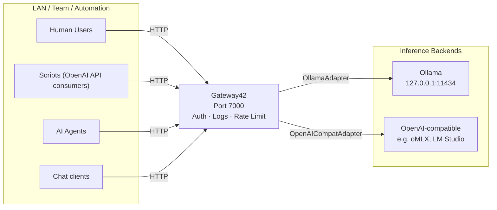

# Gateway42. — An opinionated AI gateway

**Authenticated, audited, rate-limited API gateway for local and remote LLMs. On-prem. Privacy-first.**

Gateway42. sits between your users and your AI inference backends, exposing an **OpenAI-compatible API** while adding authentication, per-user rate limiting, and full request logging. It supports both local [Ollama](https://ollama.com) instances and any remote **OpenAI-compatible endpoint** — LM Studio, oMLX, or the real OpenAI API. Any client or library built for the OpenAI API works with Gateway42. without code changes — just swap the base URL and API key.


## Architecture


```mermaid
flowchart LR
    subgraph Backends["Inference Backends"]
        OLLAMA["Ollama\n127.0.0.1:11434"]
        OPENAI["OpenAI-compatible\ne.g. oMLX, LM Studio"]
    end

    GATEWAY["Gateway42\nPort 7000\nAuth · Logs · Rate Limit"]

    subgraph LAN["LAN / Team / Automation"]
        USERS["Human Users"]
        SCRIPTS["Scripts (OpenAI API consumers)"]
        AGENTS["AI Agents"]
        CHAT["Chat clients"]
    end

    USERS & SCRIPTS & AGENTS & CHAT -->|HTTP| GATEWAY
    GATEWAY -->|OllamaAdapter| OLLAMA
    GATEWAY -->|OpenAICompatAdapter| OPENAI
```

You can run Gateway42. on the same machine as Ollama, with Ollama listening only on `127.0.0.1:11434` and never exposed over the LAN. Or point it at a remote OpenAI-compatible endpoint. Either way, all external access goes through the gateway.


## What Gateway42. adds

| Capability              | Ollama  | Gateway42 |
| ----------------------- | ------- | --------- |
| LAN API                 | No      | Yes       |
| OpenAI-compatible API   | No      | Yes       |
| Multiple engine backends| No      | Yes       |
| API key auth            | No      | Yes       |
| Per-user isolation      | No      | Yes       |
| Rate limiting           | No      | Yes       |
| AI interaction logging  | No      | Yes       |
| HTTP request logging    | No      | Yes       |
| CSV audit export        | No      | Yes       |
| Admin dashboard         | No      | Yes       |


## Design philosophy

- All access is **authenticated** via API keys — no unauthenticated requests reach the engine
- All API traffic is **logged** at the HTTP level for auditability, with AI interaction logs per user
- Rate limits **protect system stability** and prevent any single user from monopolizing inference
- The admin UI exists for **governance only**, not inference
- Inference backends stay **behind the gateway** — whether local or remote, they are never directly reachable by end users


## Quick start (not for production)

**Prerequisites:**

- Go 1.2x
- At least one inference backend: [Ollama](https://ollama.com/download) running locally, or an OpenAI-compatible endpoint

```bash
# 1. Build and start
go build -o gateway42 .
./gateway42

# 2. Open the admin UI and configure your first engine
open http://localhost:7000
```

> Default admin password is `admin123`. Change it after first login via the admin UI.

After logging in, go to **Settings** to add your first engine (Ollama or OpenAI-compatible) before making API calls.


## Installing Gateway42. as a service (launchd)

Install Gateway42. as a persistent background service that starts automatically at login:

```bash
./install.sh
```

The script will:
- Build the binary if needed
- Install it to `/usr/local/bin/gateway42`
- Create data directories at `~/.gateway42/` and `~/Library/Logs/gateway42/`
- Register and start a LaunchAgent (`com.gateway42.service`)

**Service management** — use the included `gateway42-service.sh` script:

```bash
./gateway42-service.sh start
./gateway42-service.sh stop
./gateway42-service.sh restart
./gateway42-service.sh status
```

Or directly with launchctl:

```bash
# View status and exit code
launchctl list com.gateway42.service

# Follow logs
tail -f ~/Library/Logs/gateway42/gateway.log

# Uninstall (removes binary and plist, preserves data)
./install.sh uninstall
```

The service restarts automatically on crash. It stops cleanly on `stop`.


## Multi-engine support

Gateway42. manages multiple inference engines from the admin **Settings** page. Two engine types are supported:

### Ollama

Point the gateway at a local (or LAN-accessible) Ollama instance. You need the host address and port (default: `11434`). The gateway talks to Ollama's native API and translates OpenAI-format requests automatically.

### OpenAI-compatible

Any endpoint that speaks the OpenAI API format — oMLX, LM Studio, vLLM, or the real OpenAI API. Provide the base URL and an API key if the endpoint requires one. Requests pass through directly without translation.

### Engine selection

When a request arrives at `/v1/chat/completions`, Gateway42. routes it to the first configured Ollama engine. If no Ollama engine is configured, it falls back to the first engine of any type. You can add, edit, and remove engines from the Settings page — no restart required.


## API reference

Gateway42. exposes an **OpenAI-compatible API**.
Point any OpenAI client at Gateway42. by changing the base URL and providing a Gateway42 API key.

### Base URL

```
http://<your-host>:7000/v1
```

### Authentication

Pass the user's API key as a Bearer token:

```
Authorization: Bearer <api_key>
```

Requests with a missing, invalid, or deactivated key are rejected with `401 Unauthorized`.

### Endpoints

| Endpoint | Method | Description |
| -------- | ------ | ----------- |
| `/v1/chat/completions` | POST | Chat completion. Accepts OpenAI-format bodies. Set `"stream": true` for SSE streaming. |
| `/v1/models` | GET | Returns models from the first configured engine in OpenAI format. |
| `/health` | GET | Returns `{"status": "ok"}`. No auth required. Use for uptime monitoring. |

### Example — cURL

```bash
curl http://<host>:7000/v1/chat/completions \
  -H "Authorization: Bearer <api_key>" \
  -H "Content-Type: application/json" \
  -d '{
    "model": "llama3.2:latest",
    "messages": [{"role": "user", "content": "Hello!"}]
  }'
```

### Example — Python (openai SDK)

```python
from openai import OpenAI

client = OpenAI(
    base_url="http://<host>:7000/v1",
    api_key="<api_key>",
)

response = client.chat.completions.create(
    model="llama3.2:latest",
    messages=[{"role": "user", "content": "Hello!"}],
)
print(response.choices[0].message.content)
```

### Parameters

**When routing to an Ollama engine**, Gateway42. translates standard OpenAI parameters to their Ollama equivalents:

| OpenAI parameter | Ollama parameter | Notes |
| ---------------- | ---------------- | ----- |
| `model` | `model` | Must match an installed Ollama model name |
| `messages` | `messages` | Full conversation history |
| `stream` | `stream` | SSE streaming when `true` |
| `temperature` | `temperature` | |
| `top_p` | `top_p` | |
| `max_tokens` | `num_predict` | |
| `seed` | `seed` | |
| `stop` | `stop` | String or list of strings |
| `presence_penalty` | `repeat_last_n` | |
| `frequency_penalty` | `repeat_penalty` | Mapped as `1.0 + value` |

**When routing to an OpenAI-compatible engine**, all recognized OpenAI parameters pass through directly with no translation: `temperature`, `top_p`, `seed`, `max_tokens`, `max_completion_tokens`, `frequency_penalty`, `presence_penalty`, `stop`, `response_format`, `tools`, `tool_choice`, and others.

### Error Codes

| Status | Meaning |
| ------ | ------- |
| `401` | Missing, invalid, or deactivated API key |
| `429` | Rate limit exceeded — wait before retrying |
| `502` | Gateway42. could not reach the configured engine |
| `500` | Internal server error |

### More help
Gateway42. has a built-in help page with additional information.


## Rate Limiting

Gateway42. enforces a **sliding window rate limit** per user (60-second window).

- Default: **10 requests per minute** per user
- Configurable per-user from the Admin Dashboard
- Returns `429 Too Many Requests` when exceeded
- Applies to scripts, automation, and pipelines
- Counters reset on *Reset System* or when a user is deleted
- Default for new users is set by the `DEFAULT_RATE_LIMIT` environment variable


## Admin Dashboard

Access at `http://<host>:7000`. Admin-only — not intended for end users.

### Default Admin Credentials

- No username
- Password: `admin123` (or the value of `ADMIN_PASSWORD` if set)
- **Change your password after first login**

### User Management

New users are registered with a unique API key and start in **DISABLED** status. Activate them manually once you have shared their key securely. Available actions per user:

| Action | Description |
| ------ | ----------- |
| Toggle status | Switch between **ACTIVE** and **DISABLED**. Only active users can make API requests. |
| Set rate limit | Adjust requests-per-minute (1–1000) per user. |
| New API key | Generates a fresh key and immediately invalidates the old one. Displayed once — copy it before leaving the page. |
| Export CSV | Downloads the AI interaction log (prompt, response, timestamp) for this user. Required before deletion. |
| Delete | Permanently removes the user and their log entries. CSV export must be done first. |


### Engine Management (Settings page)

The Settings page is where you configure your inference backends. For each engine you can:

- **Add** a new Ollama or OpenAI-compatible engine — name it, provide the URL and (for Ollama) the port
- **Edit** an existing engine's connection details or API key
- **Remove** an engine you no longer need
- **Test** connectivity and see which models the engine reports
- **Manage Ollama models** — search ollama.com, download with live progress, and delete models to free disk space


### Audit Logs

Gateway42. maintains two layers of logs:

**HTTP request log** — every API request to `/v1/` is recorded with: timestamp, client name, IP address, HTTP method, path, and response status code. Color-coded status badges make it easy to spot errors at a glance. This is what the main **Logs** page shows.

**AI interaction log** — the prompt and response for each chat completion, stored per user. Accessible via the per-user **Export CSV** button on the Users page.

On the Logs page:
- Search by username, path, or IP address
- Auto-refresh: Off / 5s / 10s / 30s / 60s
- Export all HTTP request log entries as CSV (`id`, `timestamp`, `method`, `path`, `client_ip`, `client_name`, `status_code`)

Request logs:  


System Logs:  


### Reset System

Permanently deletes all audit logs and rate-limit counters. User accounts and engine configurations are not affected. This action cannot be undone.


## Configuration

All configuration is via environment variables. No variables are strictly required — sensible defaults are applied. Engine connections are managed through the admin UI, not environment variables.

| Variable | Default | Description |
| -------- | ------- | ----------- |
| `ADMIN_PASSWORD` | `admin123` | Password for the admin login page. **Change after first login.** |
| `PORT` | `7000` | Port the HTTP/HTTPS server listens on. |
| `GW42_DB_PATH` | `./db/gateway.db` | Path to the SQLite database file. Avoid network-mounted filesystems. |
| `DEFAULT_RATE_LIMIT` | `10` | Default requests-per-minute for newly registered users. |
| `SESSION_TIMEOUT` | `3600` | Admin session lifetime in seconds. |
| `MAX_MESSAGE_LENGTH` | `262144` | Maximum characters stored per prompt or response in the AI interaction log (~256 KB). |
| `LOG_LEVEL` | `INFO` | Log verbosity: `DEBUG`, `INFO`, `WARNING`, `ERROR`. |
| `LOG_FILE` | `./logs/gateway.log` | Path to the application log file. |
| `TLS_CERT` | _(empty)_ | Path to TLS certificate file. When set with `TLS_KEY`, enables HTTPS. |
| `TLS_KEY` | _(empty)_ | Path to TLS private key file. When set with `TLS_CERT`, enables HTTPS. |

Using a `.env` file (native / local runs):

```bash
# .env
ADMIN_PASSWORD=your-admin-password
PORT=7000
```


## Known Design Constraints

This gateway intentionally does not handle:

| Scenario | Outcome |
| -------- | ------- |
| Hundreds of concurrent users | Inference starvation |
| Public internet traffic | Rate-limited / denied |
| Large file uploads | GPU contention |
| Unbounded token use | Latency spikes |

These are deliberate design boundaries, not bugs.
